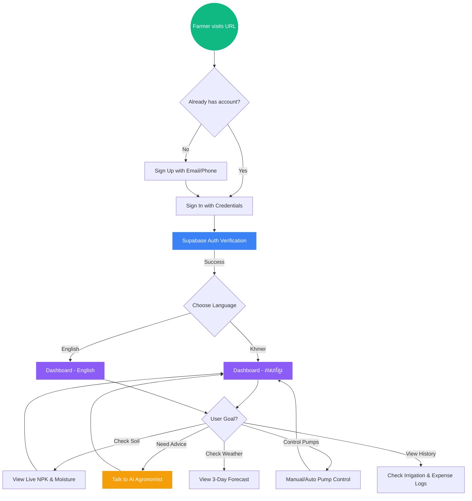

# Application Access & Navigation Flow

This diagram describes the step-by-step path a user takes to access the Smart Ag AI platform and reach its core features.

### Why this is important for your report:
By showing this flow, you prove to your professors that you have designed a **complete User Experience (UX)**. It shows that you didn't just build a single page, but a structured application with a logical path from registration to advanced AI control.
