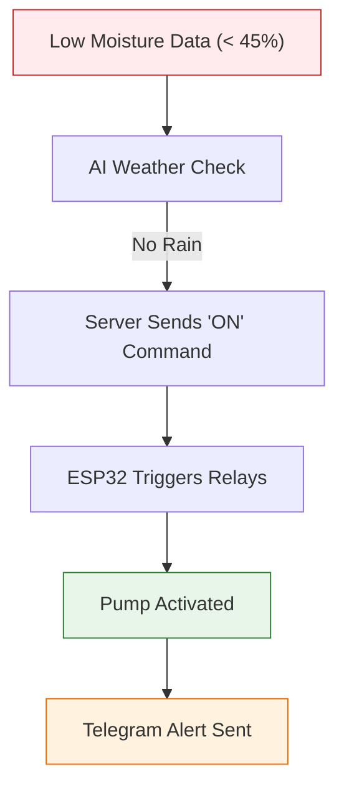
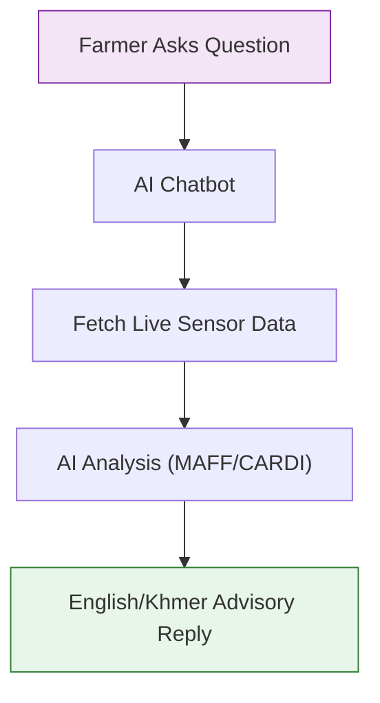

# លក្ខណៈពិសេសនៃគំរូដើម និងលំហូរការងារ (Prototype Features & User Flows)

ឯកសារនេះរៀបរាប់អំពីសមត្ថភាពបច្ចេកទេស មុខងារសំខាន់ៗ និងលំហូរនៃការប្រើប្រាស់ប្រព័ន្ធ **Smart Agriculture 4.0**។

---

## ១. លក្ខណៈពិសេសនៃគំរូដើម (Prototype Features)

ប្រព័ន្ធគំរូដើមនេះត្រូវបានរចនាឡើងដើម្បីផ្តល់នូវដំណោះស្រាយកសិកម្មឆ្លាតវៃពេញលេញ ចាប់ពីការតាមដានរហូតដល់ការបញ្ជាដោយស្វ័យប្រវត្តិ។

### លក្ខណៈសម្បត្តិផ្នែករឹង (Hardware Features):
- **ការតាមដានគុណភាពដី ៧-ក្នុង-១ (7-in-1 Soil Monitoring)**: វាស់កម្រិត NPK (អាសូត, ផូស្វ័រ, ប៉ូតាស្យូម), pH, សំណើម, សីតុណ្ហភាព និងកម្រិតចម្លងអគ្គិសនី (EC)។
- **ការតាមដានបរិយាកាស**: វាស់កម្រិតទឹកភ្លៀង និងពន្លឺព្រះអាទិត្យ។
- **ការបញ្ជាម៉ាស៊ីនបូម (Pump Control)**: ម៉ូឌុលរីឡេសម្រាប់បញ្ជាម៉ាស៊ីនបូមទឹក និងម៉ាស៊ីនដាក់ជី។
- **ប្រព័ន្ធថាមពលព្រះអាទិត្យ**: ការតាមដានស្ថានភាពថ្ម និងបន្ទះសូឡា។

### លក្ខណៈសម្បត្តិផ្នែកទន់ (Software Features):
- **ផ្ទាំងគ្រប់គ្រងពេលវេលាជាក់ស្តែង (Real-time Dashboard)**: បង្ហាញទិន្នន័យសិនស័រភ្លាមៗ (រាល់ ៥ វិនាទី)។
- **បញ្ញាសិប្បនិម្មិត AI Agronomist**: កម្មវិធីជជែក (Chatbot) ដែលផ្តល់ដំបូន្មានបច្ចេកទេសផ្អែកលើស្តង់ដារ MAFF/CARDI។
- **ការព្យាករណ៍អាកាសធាតុ**: រួមបញ្ចូលទិន្នន័យអាកាសធាតុដើម្បីបង្កើនប្រសិទ្ធភាពការស្រោចស្រព។
- **ការជូនដំណឹងស្វ័យប្រវត្តិ**: ផ្ញើសារទៅកាន់ Telegram និង SMS នៅពេលមានអាសន្ន។
- **របាយការណ៍ហិរញ្ញវត្ថុ**: តាមដានចំណាយលើការស្រោចទឹក និងការដាក់ជីដោយស្វ័យប្រវត្តិ។

---

## ២. រូបភាពអេក្រង់ និងចំណុចប្រទាក់ (Hardware + UI Description)

*រូបភាព និងការពិពណ៌នាអំពីសមាសភាគរូបវន្ត និងចំណុចប្រទាក់អ្នកប្រើប្រាស់៖*

### ផ្នែករឹង (Hardware Setup):

*រូបភាពទី១៖ ការដំឡើងឧបករណ៍ ESP32 ជាមួយនឹងសិនស័រដែលការពារដោយប្រអប់ IP65 និងប្រព័ន្ធថាមពលសូឡា។*

### ចំណុចប្រទាក់អ្នកប្រើប្រាស់ (UI Screenshots):
> [!TIP]
> **Dashboard**: បង្ហាញកាត (Cards) នៃសិនស័រនីមួយៗជាមួយនឹងក្រាហ្វិកច្បាស់ៗ។ ពណ៌បៃតងសម្រាប់ស្ថានភាពល្អ និងពណ៌ក្រហមសម្រាប់ស្ថានភាពអាសន្ន។
> 
> **AI Chat Interface**: ចំណុចប្រទាក់ជជែកដែលអនុញ្ញាតឱ្យកសិករសួរជាភាសាខ្មែរអំពីបញ្ហាដំណាំ។
> 
> **Control Panel**: ប៊ូតុងបញ្ជាម៉ាស៊ីនបូមទឹក និងជី ដែលអាចកំណត់ពេលវេលានិងបរិមាណបាន។

---

## ៣. គំនូសបំព្រួញលំហូរអ្នកប្រើប្រាស់ (User Flow Diagrams)

ដើម្បីយល់ដឹងកាន់តែច្បាស់អំពីអន្តរកម្មរវាងអ្នកប្រើប្រាស់ និងប្រព័ន្ធ សូមពិនិត្យមើលប្លង់ក្រាហ្វិកកម្រិតខ្ពស់៖
- **[ប្លង់អន្តរកម្មអ្នកប្រើប្រាស់ (Premium Diagram)](USER_SYSTEM_DIAGRAM.html)**: បង្ហាញពីទំនាក់ទំនងរវាងកសិករ ផ្ទាំងគ្រប់គ្រង និងប្រព័ន្ធ AI។

លំហូរនៃការប្រើប្រាស់ប្រព័ន្ធត្រូវបានបែងចែកជា ៣ ដំណាក់កាលសំខាន់ៗ៖

### ក. លំហូរនៃការតាមដាន (Monitoring Flow):
1. **សិនស័រ** វាស់ទិន្នន័យដី និងអាកាសធាតុ។
2. **ESP32** បញ្ជូនទិន្នន័យតាមរយៈ MQTT ទៅកាន់ Server។
3. **AI Service** វិភាគទិន្នន័យ និងពិនិត្យប្រសិទ្ធភាព។
4. **Dashboard** បង្ហាញទិន្នន័យដល់កសិករក្នុងពេលតែមួយ។

### ខ. លំហូរនៃការបញ្ជាស្វ័យប្រវត្តិ (AI Auto-Control Flow):
1. **ទិន្នន័យទាប** (ឧទាហរណ៍៖ សំណើម < ៤៥%)។
2. **AI ពិនិត្យអាកាសធាតុ** (ប្រសិនបើគ្មានភ្លៀង)។
3. **Server** ផ្ញើពាក្យបញ្ជា "បើក" ទៅកាន់ ESP32។
4. **ម៉ាស៊ីនបូម** បើកដំណើរការ។
5. **កសិករ** ទទួលបានការជូនដំណឹងតាម Telegram។

### គ. លំហូរនៃការប្រឹក្សា (AI Advisory Flow):
1. **អ្នកប្រើប្រាស់** សួរសំណួរទៅកាន់ AI Chatbot។
2. **AI** ទាញយកទិន្នន័យសិនស័របច្ចុប្បន្នមកវិភាគ។
3. **AI** ផ្តល់ចម្លើយជាភាសាខ្មែរ និងផ្ដល់អនុសាសន៍បច្ចេកទេស។

---

## ៤. ឯកសារបច្ចេកទេស API (API Documentation)

ប្រព័ន្ធត្រូវបានបង្កើតឡើងដោយប្រើប្រាស់សេវា API សំខាន់ៗចំនួនពីរ ដើម្បីធានាបាននូវមុខងារពេញលេញ និងប្រសិទ្ធភាពខ្ពស់៖

### ក. Backend API (Node.js/Express):
- **គ្រប់គ្រងឧបករណ៍**: ចុះឈ្មោះ និងតាមដានស្ថានភាពឧបករណ៍ IoT។
- **ទិន្នន័យសិនស័រ**: រក្សាទុក និងទាញយកប្រវត្តិនៃសិនស័រទាំងអស់។
- **ការបញ្ជា**: ផ្ញើពាក្យបញ្ជាទៅកាន់ម៉ាស៊ីនបូមទឹក និងជី។
- **ការជូនដំណឹង**: រួមបញ្ចូលជាមួយ Telegram Bot ដើម្បីផ្ញើសារអាសន្ន។

### ខ. AI Service API (Python/FastAPI):
- **ការវិភាគឆ្លាតវៃ**: វិភាគទិន្នន័យសិនស័រ ដើម្បីផ្តល់ដំបូន្មានបច្ចេកទេស។
- **ការព្យាករណ៍**: ប្រើប្រាស់ Machine Learning ដើម្បីព្យាករណ៍តម្រូវការទឹក និងជី។
- **AI Chatbot**: ដំណើរការដោយ Gemini AI ដើម្បីឆ្លើយតបសំណួរកសិកម្មជាភាសាខ្មែរ។

> [!NOTE]
> សម្រាប់ព័ត៌មានបច្ចេកទេសលម្អិតអំពី Endpoint នីមួយៗ សូមពិនិត្យមើលឯកសារ `API_DOCUMENTATION.md`។

---

*ឯកសារនេះត្រូវបានរៀបចំឡើងសម្រាប់ការដាក់បញ្ចូលក្នុងរបាយការណ៍បច្ចេកទេសឆ្នាំទី៣។*
