# User Interaction Diagram (Mermaid)

This diagram visualizes how the User (Farmer) interacts with various components of the Smart Agriculture 4.0 system.

```mermaid
sequenceDiagram
    autonumber
    actor Farmer as 👨‍🌾 Farmer
    participant App as 📱 Dashboard (UI)
    participant Cloud as ☁️ Backend Server
    participant AI as 🧠 AI Service (Gemini)
    participant IoT as 📟 IoT Device (ESP32)

    Note over Farmer, IoT: Daily Monitoring Flow
    IoT->>Cloud: Publish Sensor Data (MQTT: NPK, Moisture, pH)
    Cloud->>App: Real-time Update (Socket.io)
    App-->>Farmer: Shows Live Data & Alerts

    Note over Farmer, IoT: AI Advisory Flow
    Farmer->>App: Ask Question (Khmer/English)
    App->>Cloud: Send Chat Request
    Cloud->>AI: Request Analysis (Context: Live Sensors)
    AI-->>Cloud: Return Advisory Response
    Cloud-->>App: Display AI Recommendation
    App-->>Farmer: Farmer receives advice

    Note over Farmer, IoT: Control Flow (Closed Loop)
    AI->>Cloud: Alert: "Soil Dry - Trigger Water"
    Cloud->>IoT: Command: PUMP_ON (MQTT)
    IoT-->>Cloud: Confirm: PUMP_ACTIVE
    Cloud-->>App: Update Status: "Irrigation Started"
    Cloud-->>Farmer: Telegram Alert: "Watering Started 🚰"
```

### Key Interaction Points:
1. **Real-time Awareness**: The farmer is always informed via the dashboard and Telegram.
2. **Contextual AI**: The AI doesn't just chat; it looks at the *actual* data from the field before answering.
3. **Automated Reliability**: The system can act on the farmer's behalf to save crops during critical stress periods.
